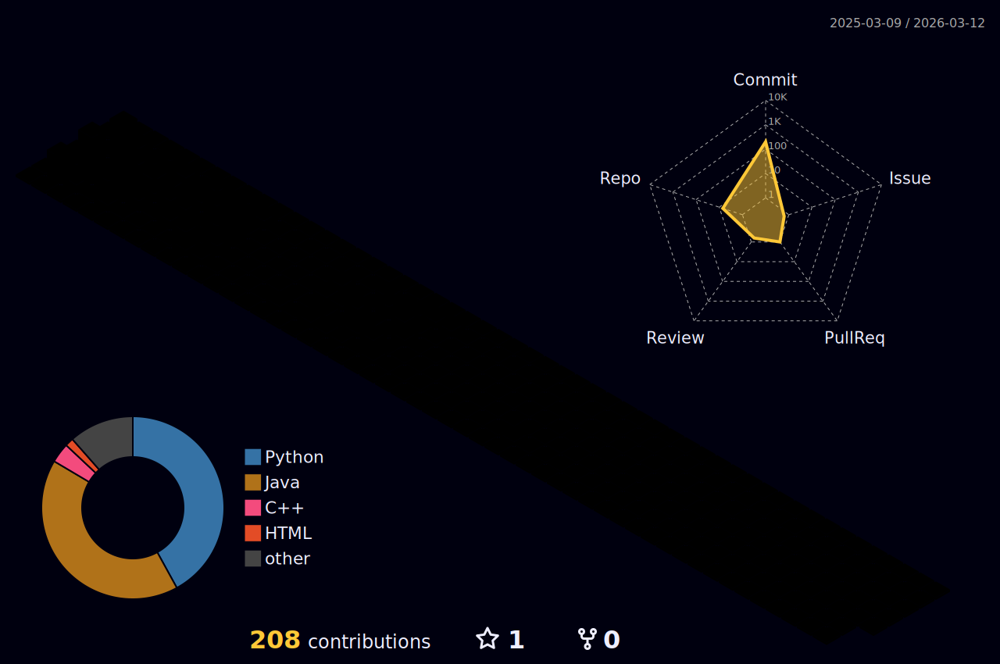

<h1 align="center">Hi 👋, I'm Julio Cesar</h1>
<h3 align="center">A passionate computering engineering student</h3>

- 🌱 I’m currently learning **Python, Java, AWS**

- 📫 How to reach me **https://www.linkedin.com/in/julio-cs-carvalho/**

<h3 align="left">Languages and Tools:</h3>

      <a href="https://www.mongodb.com/" target="_blank" rel="noreferrer">   

